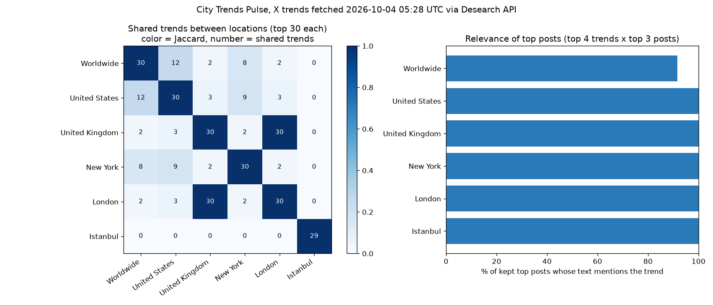

# What's moving where, 2026-10-04

Made by Desearch (https://desearch.ai). Trends fetched 2026-10-04 05:28 UTC with `GET /twitter/trends`; posts with `GET /twitter` (sort=Top, start_date=2026-10-03, count=20), ranked by likes + 2*retweets + replies + quotes.

## Locations skipped (WOEID not supported)

- **Georgia** (WOEID 23424823): API returned HTTP 200 with `woeid: null` and 30 trends; treated as unsupported (looks like a Worldwide fallback).

## Global vs local

- Trends in 3+ of 6 locations: Carti (5), Lucki (5), Brewers (3), Cavan Sullivan (3), chivas (3), Milwaukee (3), Padres (3), Ty France (3), #UFC332 (3)
- Trend volume field present on 0% of 180 trend rows (schema: name, query, rank).

- Only in **Worldwide**: 18 of 30, e.g. #向井康二のぼちぼちアフタヌーン, #auPAY公式X5周年, #みんなのIRIAMノート, KAITO, NUNEW CONCERT AT IMPACT, Ochoa
- Only in **United States**: 16 of 30, e.g. American Family Field, Austin Wells, Baylor, Chourio, Cutter Boley, Dabo
- Only in **United Kingdom**: 0 of 30 (identical trend list to London)
- Only in **New York**: 21 of 30, e.g. Boone, Gerrit Cole, Giannis, Islanders, #Isles, Kulich
- Only in **London**: 0 of 30 (identical trend list to United Kingdom)
- Only in **Istanbul**: 29 of 29, e.g. 2026 ARIA, Aliyev, #AnaParaTakvimi, Azerbaycan, Azeri, Bilinmelidir

## Worldwide

| Rank | Trend | Also trending in | Top post (engagement, age, lang) |
|---|---|---|---|
| 1 | #WilliamEstConcert | local | [@EstRvp](https://x.com/EstRvp/status/2106586897221075184) 36,747 eng, 2.0h, th: มีใครรอกดบัตรอยู่บ้างค้าบบบ ขอให้ได้บัตรกันทุกคนเลยน้า อยากเจอทุกคนจริงๆครับบบ🕯️🙏🏻🤍 #Willi [@GMMTV](https://x.com/GMMTV/status/2106601716200407215) 33,036 eng, 1.0h, en: WILLIAM EST REIGN TOGETHER CONCERT🏆 5-6 DECEMBER 2026 TICKETS SOLD OUT! #WilliamEstConcert [@wesley_gmmtv](https://x.com/wesley_gmmtv/status/2106568345936150680) 23,047 eng, 3.3h, th: น้อนตื่นเช้ามาส่งกำลังจายยย 😘❤️💙 #WilliamEstConcert #WESLEY https://t.co/2BIOiKohEc |
| 2 | #みんなのIRIAMノート | local | [@iriam_official](https://x.com/iriam_official/status/2106580478048584124) 1,439 eng, 2.5h, ja: 🔖#みんなのIRIAMノート 公開🌈(1/3) 先月のIRIAMが1冊のノートに！ IRIAMアカウントでログイン👇 ➡️https://t.co/JMafA9FBFw ※ログイン [@hikari_ojioji](https://x.com/hikari_ojioji/status/2106595541761359890) 7 eng, 1.5h, ja: 【8月の視聴時間は？】 約109時間❌ 約134時間️⭕️ らしいです🤣 IRIAMノートに 初めてIRIAM始めた日が 丁度載ってたのも嬉しい✨ ひかり☁️🌸💧の リス活ノートを [@4T3FnimdtT89571](https://x.com/4T3FnimdtT89571/status/2106604327817392491) 6 eng, 0.9h, ja: ｵﾊﾖｳｺﾞｻﾞｲﾏｽ( ¯⌓¯ )ᐝ これが噂のIRIAMノートかっ (っ ॑꒳ ॑c)ﾜｸﾜｸ MIQ《ミク》@出荷中の実績ノートを開いてみよう📖 https://t.co/D |
| 3 | Tala | United States | [@tudimebeto](https://x.com/tudimebeto/status/2106588378158211396) 11,332 eng, 1.9h, es: Tala Rangel viendo el segundo gol de Estados Unidos https://t.co/h2D6jd1Sr1 [@migueemx](https://x.com/migueemx/status/2106574688730181647) 4,807 eng, 2.8h, es: El brillante Tala Rangel https://t.co/pIfgOBkvty [@ImAleeJeje](https://x.com/ImAleeJeje/status/2106588183278322093) 3,048 eng, 1.9h, es: Gol de Estados Unidos ⚽🇺🇸 Jubilen al p*ndejo del Tala Rangel 🤬 https://t.co/6zXxGrkUdK |
| 4 | chivas | New York, United States | [@Jesus_Bernal](https://x.com/Jesus_Bernal/status/2106565504680755415) 5,120 eng, 3.4h, es: Chivas es base de la selección. Cuéntenla como quieran. TODA, TODA, de Gabriel Milito. htt [@Chivas](https://x.com/Chivas/status/2106568499229532620) 3,371 eng, 3.2h, es (does not mention trend): 🇦🇹 ¡@miseleccionmx arranca con 5 Rojiblancos para su encuentro de esta noche! 🇦🇹 ¡VENGA! 👏 [@sott_daylight](https://x.com/sott_daylight/status/2106571836834136496) 2,911 eng, 3.0h, es: Cuando estoy teniendo un día dlv pero me acuerdo de Luis Romo en las chivas y me siento má |

## United States

| Rank | Trend | Also trending in | Top post (engagement, age, lang) |
|---|---|---|---|
| 1 | Lucki | London, New York, United Kingdom, Worldwide | [@kurtos](https://x.com/kurtos/status/2106550620027031703) 52,183 eng, 4.4h, en: lucki took that sh*t to the neck like a f***ing champ kirk got nothing on you big tuneski  [@yarbogotguap](https://x.com/yarbogotguap/status/2106548691360452975) 31,136 eng, 4.6h, en: Just saw the lucki video… https://t.co/8L5S3nuKVD [@STRAPPEDUS](https://x.com/STRAPPEDUS/status/2106545885803155777) 20,158 eng, 4.7h, en: LUCKI WAS REPORTEDLY STABBED AT COMPLEXCON 💔 PRAYERS UP 🙏 https://t.co/Xetg8E0e6L |
| 2 | Brewers | New York, Worldwide | [@JeffPassan](https://x.com/JeffPassan/status/2106597588757782779) 3,768 eng, 1.3h, en: FINAL: Brewers 3, Padres 2 What a tremendous game. Battle of the bullpens decided by Willi [@MLBONFOX](https://x.com/MLBONFOX/status/2106542927065530839) 3,637 eng, 4.9h, en: The Atmosphere in Milwaukee is ELECTRIC ahead of Game 1 of the NLDS between the Padres and [@NationPadres](https://x.com/NationPadres/status/2106597821185134829) 2,171 eng, 1.3h, en: You make me sick to my stomach @MLB @MLBUA @Brewers Just robbed the Padres of one of the m |
| 3 | Ty France | New York, Worldwide | [@BenVerlander](https://x.com/BenVerlander/status/2106596998061416864) 3,070 eng, 1.4h, en: This is absolute MADNESS in the 9th Ty France hit a MOONSHOT that was going to be a Homeru [@MLB](https://x.com/MLB/status/2106599089538548133) 3,032 eng, 1.2h, en: A WILD 9th inning in Milwaukee Ty France hit a ball off the roof and it landed in Jackson  [@NationPadres](https://x.com/NationPadres/status/2106598957766123818) 1,099 eng, 1.2h, en: For context: Ty France hit the ball 105.3 mph and 49 degrees This ball was a home run |
| 4 | Padres | New York, Worldwide | [@MLBONFOX](https://x.com/MLBONFOX/status/2106542927065530839) 3,637 eng, 4.9h, en: The Atmosphere in Milwaukee is ELECTRIC ahead of Game 1 of the NLDS between the Padres and [@BenVerlander](https://x.com/BenVerlander/status/2106596998061416864) 3,072 eng, 1.4h, en: This is absolute MADNESS in the 9th Ty France hit a MOONSHOT that was going to be a Homeru [@CalicoJoeMLB](https://x.com/CalicoJoeMLB/status/2106597442766733633) 2,650 eng, 1.3h, en: This is why Baseball should be played in outdoor environments whenever possible. I’d be ab |

## United Kingdom

| Rank | Trend | Also trending in | Top post (engagement, age, lang) |
|---|---|---|---|
| 1 | Croatia | London | [@UTDTrey](https://x.com/UTDTrey/status/2106424583935144181) 29,155 eng, 12.8h, en: Croatia pulling up to a game with Modric, Perisic &amp; Kovacic in 2026 https://t.co/o6mX0 [@FCBarcelona](https://x.com/FCBarcelona/status/2106451775498637367) 28,028 eng, 11.0h, en: ⚽️+🅰️ Gordon scored and provided an assist in England’s 0-7 win over Croatia. Livaković st [@TrollFootball](https://x.com/TrollFootball/status/2106444997222707457) 22,587 eng, 11.4h, en: Croatia vs England https://t.co/1EPVAQsH6o |
| 2 | #UFC332 | London, United States | [@DelinquentMMA](https://x.com/DelinquentMMA/status/2106553563132649775) 8,608 eng, 4.2h, pl: 🔥 Mackenzie Dern, Polyana Viana and Tracy Cortez at #UFC332 https://t.co/VJiGP1JXg6 [@ChampRDS](https://x.com/ChampRDS/status/2106542658562973833) 8,457 eng, 5.0h, en: ROMAN KOPYLOV KNOCKS OUT ATEBA GAUTIER IN THE FIRST ROUND 🤯 ATEBA'S FIRST LOSS IN THE UFC  [@THATBOYMMAGURU](https://x.com/THATBOYMMAGURU/status/2106523755442995411) 7,269 eng, 6.2h, en: The UFC matchmakers realising that they can make trash cards turn out generational every t |
| 3 | #strictly | London | [@flickersuggs](https://x.com/flickersuggs/status/2106466796781945132) 7,258 eng, 10.0h, en: i can’t explain how much i love watching two women dancing together and it’s so so special [@RyanSoapKing25](https://x.com/RyanSoapKing25/status/2106457639055937589) 795 eng, 10.6h, en: Johannes is really settling in now. He's much better tonight. #Strictly [@ultimatesugg](https://x.com/ultimatesugg/status/2106463829953527830) 410 eng, 10.2h, en: SEND THEM STRAIGHT TO THE FINAL NOW #Strictly https://t.co/zf4oAodLkU |
| 4 | #CROENG | London | [@HNSfamily](https://x.com/HNSfamily/status/2106443067217858870) 449 eng, 11.6h, en: Final whistle in Rijeka, congratulations to @England. 🇭🇷🏴󠁧󠁢󠁥󠁮󠁧󠁿 #CROENG #HrabarBroj / #Nat [@_Dani_D_](https://x.com/_Dani_D_/status/2106443210159776223) 143 eng, 11.5h, qme: #CROENG https://t.co/JpOFs0IXlI [@favour71087](https://x.com/favour71087/status/2106436441597243711) 130 eng, 12.0h, en: Croatia 0–5 England W*F did Thomas Tuchel tell these England players😒 #CROENG 🇭🇷🏴 https:// |

## New York

| Rank | Trend | Also trending in | Top post (engagement, age, lang) |
|---|---|---|---|
| 1 | #Postseason | local | [@RaysBaseball](https://x.com/RaysBaseball/status/2106529083072930070) 2,058 eng, 5.9h, en: FIRST HOME RUN BELONGS TO JONATHAN ARANDA #ForTampaBay / #Postseason https://t.co/WeB6rT8b [@valecotah](https://x.com/valecotah/status/2106455170959950202) 458 eng, 10.8h, es: No puedo bb, hay #postseason [@Kathy_Martinez5](https://x.com/Kathy_Martinez5/status/2106519248239739271) 318 eng, 6.5h, en: Shoutout to all the fans baking with us out here in the 102° weather !! 😭🥵 Dodgers Win, no |
| 2 | #Isles | local | [@NYIslanders](https://x.com/NYIslanders/status/2106568592858992761) 1,831 eng, 3.2h, en: THAT'S AN #ISLES HOME OPENER WIN. https://t.co/2HzYhgxJhU [@IslesTerritory](https://x.com/IslesTerritory/status/2106568596897837412) 500 eng, 3.2h, en: FIRST WIN OF THE SEASON SOROKIN SHUTOUT HIT IT! #Isles https://t.co/Gw0EiqoiDZ [@IslesMSGN](https://x.com/IslesMSGN/status/2106574201649803708) 499 eng, 2.9h, en: Victor Eklund is named first star after earning his first 2 NHL points and Shannon Hogan l |
| 3 | Boone | local | [@BooneAccess](https://x.com/BooneAccess/status/2106468228746641578) 1,247 eng, 9.9h, en: BENSON BOONE HAVING FUN(??) 😭😭😭 https://t.co/tui1McXH9p [@infobensonboone](https://x.com/infobensonboone/status/2106470652823929326) 896 eng, 9.7h, pt: 📸 Novas atualizações de Benson Boone em seu Instagram. https://t.co/njqDIjeMK9 [@BooneAccess](https://x.com/BooneAccess/status/2106469687328641533) 818 eng, 9.8h, en: okay mr benson boone https://t.co/O3lfbtTVg6 |
| 4 | Victor Eklund | local | [@RTaub_](https://x.com/RTaub_/status/2106570135175885231) 2,001 eng, 3.1h, en: Islanders fans sing Victor Eklund happy birthday after he was named 1st star of the game h [@NYIslanders](https://x.com/NYIslanders/status/2106564990606184846) 1,546 eng, 3.5h, en: HAPPY BIRTHDAY VICTOR EKLUND. https://t.co/c953ELNnCA [@NYIslanders](https://x.com/NYIslanders/status/2106565642778234978) 1,459 eng, 3.4h, en: FIRST CAREER GOAL ON YOUR BIRTHDAY? HAVE A DAY VICTOR EKLUND. https://t.co/QS0ILtjxW6 |

## London

| Rank | Trend | Also trending in | Top post (engagement, age, lang) |
|---|---|---|---|
| 1 | Croatia | United Kingdom | [@UTDTrey](https://x.com/UTDTrey/status/2106424583935144181) 29,155 eng, 12.8h, en: Croatia pulling up to a game with Modric, Perisic &amp; Kovacic in 2026 https://t.co/o6mX0 [@FCBarcelona](https://x.com/FCBarcelona/status/2106451775498637367) 28,028 eng, 11.0h, en: ⚽️+🅰️ Gordon scored and provided an assist in England’s 0-7 win over Croatia. Livaković st [@TrollFootball](https://x.com/TrollFootball/status/2106444997222707457) 22,587 eng, 11.4h, en: Croatia vs England https://t.co/1EPVAQsH6o |
| 2 | #UFC332 | United Kingdom, United States | [@DelinquentMMA](https://x.com/DelinquentMMA/status/2106553563132649775) 8,608 eng, 4.2h, pl: 🔥 Mackenzie Dern, Polyana Viana and Tracy Cortez at #UFC332 https://t.co/VJiGP1JXg6 [@ChampRDS](https://x.com/ChampRDS/status/2106542658562973833) 8,457 eng, 5.0h, en: ROMAN KOPYLOV KNOCKS OUT ATEBA GAUTIER IN THE FIRST ROUND 🤯 ATEBA'S FIRST LOSS IN THE UFC  [@THATBOYMMAGURU](https://x.com/THATBOYMMAGURU/status/2106523755442995411) 7,269 eng, 6.2h, en: The UFC matchmakers realising that they can make trash cards turn out generational every t |
| 3 | #strictly | United Kingdom | [@flickersuggs](https://x.com/flickersuggs/status/2106466796781945132) 7,258 eng, 10.0h, en: i can’t explain how much i love watching two women dancing together and it’s so so special [@RyanSoapKing25](https://x.com/RyanSoapKing25/status/2106457639055937589) 795 eng, 10.6h, en: Johannes is really settling in now. He's much better tonight. #Strictly [@ultimatesugg](https://x.com/ultimatesugg/status/2106463829953527830) 410 eng, 10.2h, en: SEND THEM STRAIGHT TO THE FINAL NOW #Strictly https://t.co/zf4oAodLkU |
| 4 | #CROENG | United Kingdom | [@HNSfamily](https://x.com/HNSfamily/status/2106443067217858870) 449 eng, 11.6h, en: Final whistle in Rijeka, congratulations to @England. 🇭🇷🏴󠁧󠁢󠁥󠁮󠁧󠁿 #CROENG #HrabarBroj / #Nat [@_Dani_D_](https://x.com/_Dani_D_/status/2106443210159776223) 143 eng, 11.5h, qme: #CROENG https://t.co/JpOFs0IXlI [@favour71087](https://x.com/favour71087/status/2106436441597243711) 130 eng, 12.0h, en: Croatia 0–5 England W*F did Thomas Tuchel tell these England players😒 #CROENG 🇭🇷🏴 https:// |

## Istanbul

| Rank | Trend | Also trending in | Top post (engagement, age, lang) |
|---|---|---|---|
| 1 | #pazar | local | [@SehEray2828](https://x.com/SehEray2828/status/2106611808161177843) 65 eng, 0.4h, tr: Günaydın arkadaşlar 🌤️ Güzel bir gün diliyorum 🎉 #pazar https://t.co/VZ8teSASxR [@aynuryildiriim](https://x.com/aynuryildiriim/status/2106602698552254946) 63 eng, 1.0h, tr: Günaydınnnn Gün güzellikler getirsin. #Pazar 🍂 https://t.co/JyOJwlAmGP [@ipexceli](https://x.com/ipexceli/status/2106608195313574160) 54 eng, 0.6h, tr: Günnnnaydınnn :)) Aç sesi aç aç #pazar https://t.co/iPOMnHnfiu |
| 2 | #pazar | local | [@SehEray2828](https://x.com/SehEray2828/status/2106611808161177843) 65 eng, 0.4h, tr: Günaydın arkadaşlar 🌤️ Güzel bir gün diliyorum 🎉 #pazar https://t.co/VZ8teSASxR [@aynuryildiriim](https://x.com/aynuryildiriim/status/2106602698552254946) 63 eng, 1.0h, tr: Günaydınnnn Gün güzellikler getirsin. #Pazar 🍂 https://t.co/JyOJwlAmGP [@ipexceli](https://x.com/ipexceli/status/2106608195313574160) 54 eng, 0.6h, tr: Günnnnaydınnn :)) Aç sesi aç aç #pazar https://t.co/iPOMnHnfiu |
| 3 | #HerFonaAnaPara | local | [@haberdosandos](https://x.com/haberdosandos/status/2106289894238941490) 2,929 eng, 21.7h, tr: Fonlara 2.500.000 TL’sini kaptıran bir vatandaş: “Ana parayı verse öpüp tepeme koyarım. Fo [@FonMagdur77](https://x.com/FonMagdur77/status/2106278948342493625) 2,259 eng, 22.4h, tr: Yettiniz artık... Kendi içinizde bir birinizi yiyorsunuz. En mağdur kim? - PPF mi? - Serbe [@HAKKIMIZYENDI](https://x.com/HAKKIMIZYENDI/status/2106308658711671022) 1,972 eng, 20.5h, tr: Herkesin hakkının verilerek adaletin sağlanmasını, ana paranın tamamının en kısa süre için |
| 4 | #AnaParaTakvimi | local | [@HAKKIMIZYENDI](https://x.com/HAKKIMIZYENDI/status/2106294852723859713) 2,224 eng, 21.4h, tr: Bizim paramızı kim çaldıysa Devletimiz bulup getirecektir. Mağdur insanların tek isteği an [@HAKKIMIZYENDI](https://x.com/HAKKIMIZYENDI/status/2106308658711671022) 1,972 eng, 20.5h, tr: Herkesin hakkının verilerek adaletin sağlanmasını, ana paranın tamamının en kısa süre için [@Bugihan333](https://x.com/Bugihan333/status/2106391708036374720) 1,919 eng, 15.0h, tr: Sayın Cevdet Yılmaz, TLY (Tera portföy birinci serbest fon) yatırımcıları olarak 16 Eylül  |

## Data quality checks

- Kept top posts: 57 across 19 trends; searches with 0 posts: 0.
- Relevance: 98% of kept posts mention the trend in text or hashtags (all fetched posts: 95%).
- Freshness: median age of kept posts 4.2 h; 100% within 24 h; oldest 22.4 h; posts older than 48 h among all fetched: 0.
- Language mix of kept posts (X `lang` codes; `qme` = media only, `und` = undetermined): en 33, tr 9, es 7, ja 3, th 2, pl 1, qme 1, pt 1
- Duplicates: 0 repeated texts under different post ids; 10 post ids returned under 2+ trends; authors with 3+ fetched posts: @ChampRDS (6), @snyyankees (5), @WETrendingTeam (4), @RyanSoapKing25 (4), @milamkey (3), @ufc (3), @HNSfamily (3), @IslesRumor (3)

## Reply sample (#1 post per location, `GET /twitter/replies/post`)

- Worldwide: post 2106586897221075184: 10 replies returned, 10 in the same conversation; langs th 6, en 3, qme 1
- United States: post 2106550620027031703: 10 replies returned, 10 in the same conversation; langs en 4, qme 4, qam 1, ht 1
- United Kingdom: post 2106424583935144181: 10 replies returned, 10 in the same conversation; langs qme 7, en 3
- New York: post 2106529083072930070: 10 replies returned, 10 in the same conversation; langs en 7, qme 2, in 1
- London: post 2106424583935144181: 10 replies returned, 10 in the same conversation; langs en 4, qme 4, es 1, und 1
- Istanbul: post 2106289894238941490: 10 replies returned, 10 in the same conversation; langs tr 9, en 1

## Cost and latency

- Calls: 32, errors: 0, total cost $0.0975 (sum of `X-Desearch-Cost-Usd`).
- Latency: trends median 0.49s, search median 3.62s, max 10.03s.

Files: trends-2026-10-04.csv, posts-2026-10-04.csv, overlap-2026-10-04.png, costs-2026-10-04.csv, raw-2026-10-04.json
