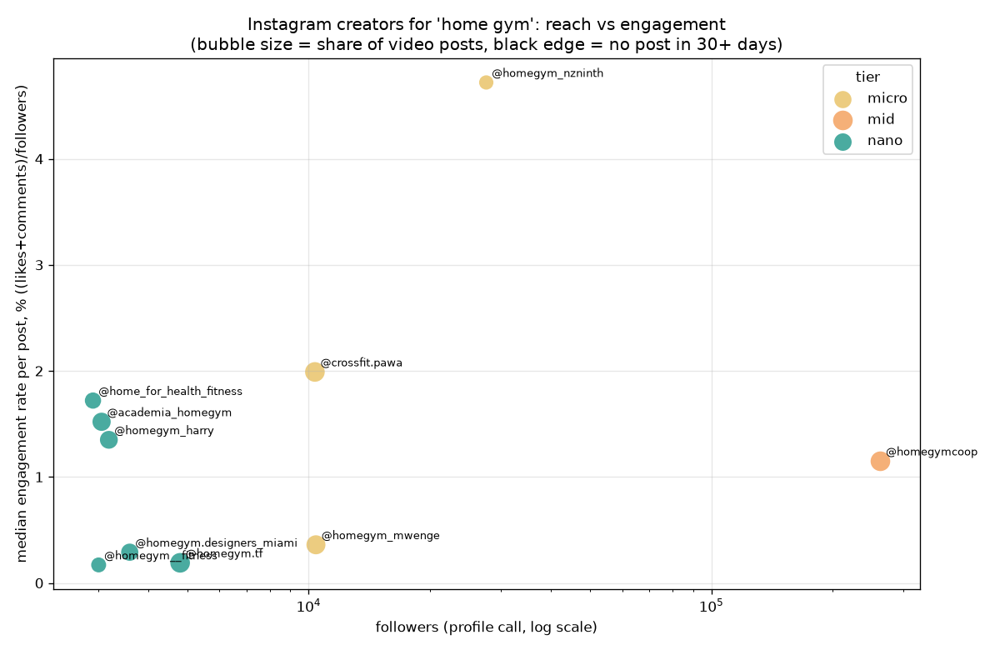

# Instagram creator shortlist: 'home gym', 2026-10-06

Made by Desearch (https://desearch.ai). Fetched 2026-10-06 05:32 UTC: `POST /desearch/instagram/search` (count=20), `GET /desearch/instagram/profile/{username}` for every result, and `GET /desearch/instagram/profile/{username}/posts` (count=12) for up to 10 public creators with at least 1,000 followers.

Engagement rate = (likes + comments) / followers per post, median over the posts returned (pinned posts excluded). Cadence = posts in the last 30 days and median days between posts.

## Nano creators

| Rank | Creator | Followers | Median ER | Median likes | Median comments | Posts in 30 d | Median gap | Last post | Video share |
|---|---|---|---|---|---|---|---|---|---|
| 1 | [@home_for_health_fitness](https://www.instagram.com/home_for_health_fitness/) | 2,912 | 1.72% | 50 | 0 | 4 | 5.9 d | 3 d ago | 55% |
| 2 | [@academia_homegym](https://www.instagram.com/academia_homegym/) | 3,059 | 1.52% | 44 | 0 | 7 | 3.1 d | 4 d ago | 80% |
| 3 | [@homegym_harry](https://www.instagram.com/homegym_harry/) | 3,189 | 1.35% | 33 | 10 | 12 | 0.3 d | 0 d ago | 75% |
| 4 | [@homegym.designers_miami](https://www.instagram.com/homegym.designers_miami/) | 3,593 | 0.29% | 10 | 0 | 12 | 1.1 d | 0 d ago | 67% |
| 5 | [@homegym.tf](https://www.instagram.com/homegym.tf/) | 4,793 | 0.19% | 3 | 6 | 1 | 16.8 d | 4 d ago | 100% |
| 6 | [@homegym__fitness](https://www.instagram.com/homegym__fitness/) | 3,008 | 0.17% | 3 | 2 | 10 | 1.9 d | 1 d ago | 40% |

## Micro creators

| Rank | Creator | Followers | Median ER | Median likes | Median comments | Posts in 30 d | Median gap | Last post | Video share |
|---|---|---|---|---|---|---|---|---|---|
| 1 | [@homegym_nzninth](https://www.instagram.com/homegym_nzninth/) | 27,595 | 4.72% | 1,274 | 33 | 2 | 6.8 d | 14 d ago | 33% |
| 2 | [@crossfit.pawa](https://www.instagram.com/crossfit.pawa/) | 10,359 | 1.99% | 182 | 24 | 1 | 2.6 d | 27 d ago | 100% |
| 3 | [@homegym_mwenge](https://www.instagram.com/homegym_mwenge/) | 10,420 | 0.36% | 38 | 1 | 11 | 0.5 d | 0 d ago | 91% |

## Mid creators

| Rank | Creator | Followers | Median ER | Median likes | Median comments | Posts in 30 d | Median gap | Last post | Video share |
|---|---|---|---|---|---|---|---|---|---|
| 1 | [@homegymcoop](https://www.instagram.com/homegymcoop/) ✓ | 262,657 | 1.15% | 2,952 | 66 | 10 | 1.0 d | 0 d ago | 100% |

## Searched but not pulled

10 of 20 search results were not pulled: @homegymvillian (52 followers), @parass2.kh (421 followers), @homegym_yumbo (1,889 followers), @showan_homegym (202 followers), @homegym.papa (335 followers), @home__gym___functional (2,437 followers), @home_gym.2022 (1,211 followers), @jambibugar.gym (820 followers), @homegym_aparatos (2,075 followers), @fortius_movimientoysalud (1,428 followers)

## Data quality checks

- Search results: 20, types: profile 20; repeated usernames: 0.
- Followers, search vs profile call: 10 of 10 identical.
- `postsCount` on profiles: 12 (20); search `mediaCount`: 12 (10), missing (10).
- Posts returned per creator: 12 (10) (requested 12).
- Duplicate post ids: 0.
- Posts out of date order (newer than the post before it): 9 across 7 creators; leading posts treated as pinned and excluded from ER/cadence: 14 (no pinned flag in the response).
- Post age: median 17 d, newest 0.2 d, oldest 911 d.
- Posts with `commentCount` 0: 34 of 120; `viewCount` present on 0, `playCount` on 89.
- `hashtags[]` filled on 58 posts; captions containing #tags: 58.
- Calls: 31, errors: 0, total cost $0.3312 (sum of `X-Desearch-Cost-Usd`); billed units 160 vs items returned 160.
- Latency: median 2.39s, max 6.26s.

Files: shortlist-2026-10-06-home-gym.csv, profiles-2026-10-06-home-gym.csv, posts-2026-10-06-home-gym.csv, engagement-2026-10-06-home-gym.png, costs-2026-10-06-home-gym.csv, raw-2026-10-06-home-gym.json
