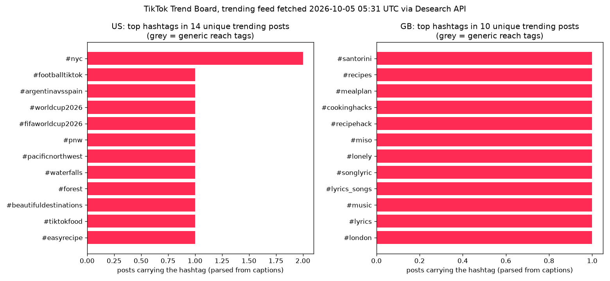

# What's moving on TikTok, 2026-10-05

Made by Desearch (https://desearch.ai). Trending feed fetched 2026-10-05 05:31 UTC with `GET /desearch/tiktok/trending` (count=30 per region); hashtag posts with `GET /desearch/tiktok/hashtag/{tag}` (count=20).

## Feed at a glance

| Region | Posts returned | Unique posts | Duplicates | Median age (days) | Newest | Oldest | Total plays (unique) | Median like rate |
|---|---|---|---|---|---|---|---|---|
| US | 16 | 14 | 2 | 31 | 7.5 d | 68 d (2026-07-28) | 62,500,895 | 12.4% |
| GB | 16 | 10 | 6 | 53 | 0.1 d | 76 d (2026-07-20) | 105,600,235 | 11.9% |

Age buckets of unique trending posts: <1 d 1, 1-7 d 0, 7-30 d 9, 30-90 d 14, >90 d 0

## US: top hashtags

| Hashtag | Posts | Plays | Likes | Shares |
|---|---|---|---|---|
| #nyc | 2 | 17,472 | 2,461 | 27 |
| #footballtiktok | 1 | 43,057,297 | 4,476,804 | 151,873 |
| #argentinavsspain | 1 | 43,057,297 | 4,476,804 | 151,873 |
| #worldcup2026 | 1 | 43,057,297 | 4,476,804 | 151,873 |
| #fifaworldcup2026 | 1 | 43,057,297 | 4,476,804 | 151,873 |
| #pnw | 1 | 13,707,490 | 1,853,652 | 249,411 |
| #pacificnorthwest | 1 | 13,707,490 | 1,853,652 | 249,411 |
| #waterfalls | 1 | 13,707,490 | 1,853,652 | 249,411 |
| #forest | 1 | 13,707,490 | 1,853,652 | 249,411 |
| #beautifuldestinations | 1 | 13,707,490 | 1,853,652 | 249,411 |

Top US posts by plays:

| Post | Plays | Likes | Shares | Posted | Caption |
|---|---|---|---|---|---|
| [@fangirlarena](https://www.tiktok.com/@fangirlarena/video/7667946524512357645) | 43,057,297 | 4,476,804 | 151,873 | 2026-07-29 | Argentine Beautiful Lady 🇦🇷❤️ / Argentina vs Spain FIFA World Cup 2026 |
| [@izak.pnw](https://www.tiktok.com/@izak.pnw/video/7672528568701996302) | 13,707,490 | 1,853,652 | 249,411 | 2026-08-10 | A peaceful walk through Oregon’s emerald-green trails, with the mist o |
| [@ashley_recipes](https://www.tiktok.com/@ashley_recipes/video/7682049568975932702) | 3,379,933 | 72,563 | 23,507 | 2026-09-05 | Hot Honey Garlic Chicken Tacos 🌮 Crispy, sticky, cheesy, loaded with c |
| [@tmt999900](https://www.tiktok.com/@tmt999900/video/7677464456699383060) | 1,080,080 | 117,245 | 13,856 | 2026-08-24 | “Thành công của một người đàn ông”#mercedes #maybach #dream #fyp #vira |
| [@imrankhan.pti](https://www.tiktok.com/@imrankhan.pti/video/7676258998873509140) | 915,314 | 286,886 | 1,610 | 2026-08-20 | اور جو شخص اللہ پر توکل کرتا ہے (بھروسہ کرتا ہے) تو وہ اس کے لیے کافی  |

## GB: top hashtags

| Hashtag | Posts | Plays | Likes | Shares |
|---|---|---|---|---|
| #santorini | 1 | 33,598,543 | 6,867,946 | 674,528 |
| #recipes | 1 | 3,807,716 | 110,715 | 157,111 |
| #mealplan | 1 | 3,807,716 | 110,715 | 157,111 |
| #cookinghacks | 1 | 3,807,716 | 110,715 | 157,111 |
| #recipehack | 1 | 3,807,716 | 110,715 | 157,111 |
| #miso | 1 | 3,807,716 | 110,715 | 157,111 |
| #lonely | 1 | 1,582,571 | 213,791 | 7,769 |
| #songlyric | 1 | 1,582,571 | 213,791 | 7,769 |
| #lyrics_songs | 1 | 1,582,571 | 213,791 | 7,769 |
| #music | 1 | 1,582,571 | 213,791 | 7,769 |

Top GB posts by plays:

| Post | Plays | Likes | Shares | Posted | Caption |
|---|---|---|---|---|---|
| [@jacobcollier](https://www.tiktok.com/@jacobcollier/video/7664692269005409558) | 44,567,655 | 7,054,744 | 324,719 | 2026-07-20 | 🇮🇹🦋🇮🇹🦋🇮🇹 |
| [@collinaesthetics](https://www.tiktok.com/@collinaesthetics/video/7670956407331605773) | 33,598,543 | 6,867,946 | 674,528 | 2026-08-06 | #fyp #santorini  |
| [@megaamerican](https://www.tiktok.com/@megaamerican/video/7687237148449312014) | 17,673,005 | 2,483,159 | 81,819 | 2026-09-19 | behind the scenes |
| [@linds.cooks](https://www.tiktok.com/@linds.cooks/video/7670020648084704526) | 3,807,716 | 110,715 | 157,111 | 2026-08-04 | is this just new for me??? #recipes #mealplan #CookingHacks #recipehac |
| [@alphaville](https://www.tiktok.com/@alphaville/video/7689114817864404257) | 2,369,752 | 379,465 | 11,060 | 2026-09-24 | 42 years ago we released our third single of our debut album „Forever  |

## Across regions

- Posts in both US and GB: 0.
- Hashtags in the top 10 of every region: none.
- Sounds: `music.title` present on 0 of 24 unique trending posts (the field is not returned, so sounds cannot be ranked).

## Hashtag drill-down

| Hashtag | Posts returned | Unique | Carry the tag in caption | Median age (days) | Oldest | Top post |
|---|---|---|---|---|---|---|
| #nyc | 18 | 18 | 17/18 | 9 | 314 d | [@elysian.living](https://www.tiktok.com/@elysian.living/video/7576734136593927454) 43,129,490 plays |
| #footballtiktok | 20 | 20 | 20/20 | 0 | 96 d | [@wadjy9](https://www.tiktok.com/@wadjy9/video/7657432351261068576) 3,201,770 plays |
| #argentinavsspain | 20 | 20 | 20/20 | 1 | 8 d | [@chocolate_girl909](https://www.tiktok.com/@chocolate_girl909/video/7690173581967248671) 18,179,347 plays |

## Comments on the top trending post (7664692269005409558)

- 17 comments returned; newest 0 d old; top liked: "These guy can literally see music" (775823 likes); "“What do you play?”, “People, I play people”" (619945 likes); "i just knew the mf would have bare feet" (503220 likes)

## Data quality

- `hashtags[]` field filled on 0 of 24 unique trending posts; hashtags above are parsed from captions.
- Posts with no `text` field: 0 of 24.
- Duplicate post ids inside one response: 8 (trending) and 0 (hashtag).

Files: posts-2026-10-05.csv, hashtags-2026-10-05.csv, comments-2026-10-05.csv, top-hashtags-2026-10-05.png, costs-2026-10-05.csv, raw-2026-10-05.json
