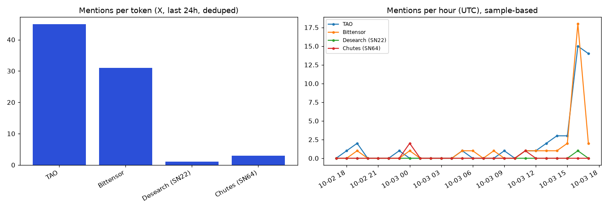

# Token Narrative Pulse, 2026-10-03

Made by Desearch ([desearch.ai](https://desearch.ai))

Window: 2026-10-02 17:10 to 2026-10-03 17:10 UTC. Source: Desearch API (X search + AI Search with Reddit).

## Mentions (X, deduplicated, inside the 24h window)

| Token | Mentions | Unique authors |
|---|---|---|
| TAO | 45 | 42 |
| Bittensor | 31 | 29 |
| Desearch (SN22) | 1 | 1 |
| Chutes (SN64) | 3 | 2 |

Posts returned: 94; unique: 85; inside window: 63; outside window (dropped): 22; posts missing an engagement field: 0.

These are counts inside a sample (Top + Latest, `--count` posts per query), not total X volume. Latest returns the newest posts, so the last hours look busier in the hourly chart.

## Top 5 posts by engagement

Engagement = likes + 2 x reposts + replies + quotes.

| # | Author | Likes | Reposts | Replies | Views | Posted (UTC) | Post |
|---|---|---|---|---|---|---|---|
| 1 | @cryptocandy24x | 171 | 8 | 6 | 9240 | 2026-10-02T19:49 | [$TAO trend line retest on daily Must hold 270-280$ Tp same 300-400-700- #ATH #DCA #hodl https://t.co/dDPf49hG8](https://x.com/cryptocandy24x/status/2106109447559119143) |
| 2 | @nordin_eth | 152 | 6 | 4 | 10884 | 2026-10-03T12:26 | [$TAO bulls have a pretty simple job here: Protect $280 Take back $300 Break $320 Let momentum handle the rest ](https://x.com/nordin_eth/status/2106360114684850344) |
| 3 | @0x_Kalista | 70 | 0 | 71 | 498 | 2026-10-03T05:31 | [GM! The wallet built by the people who built Bittensor 👀 For more context: Crucible Labs was co-founded by Ala](https://x.com/0x_Kalista/status/2106255881830846808) |
| 4 | @Donaxbt | 99 | 7 | 6 | 5103 | 2026-10-03T14:02 | [$10,000+ per $TAO if Subnets game keeps accelerating the same way it has been over the last 8/12 months](https://x.com/Donaxbt/status/2106384418952630573) |
| 5 | @JesusMartinez | 76 | 15 | 11 | 4476 | 2026-10-03T13:00 | [I sat down w/ the Co-Founder of $TAO & current CEO of @affine_io, @const_reborn to chat on what's coming for B](https://x.com/JesusMartinez/status/2106368684126036171) |

## Spam and duplicate check

- Identical-text groups (after stripping links/punctuation): 0
- Authors with 3+ posts in the sample: @bittensor_alert (3)
- Template groups (2+ authors, same closing text): 1 groups, 8 posts
  - 8 posts by @ParkerBenS9, @JustinMorganQ8, @EthanParker672, @CarsonBoydA5, @AndrewJenkinsT6, @AsherMorganS5: "...$RENDER, $TAO , $FET , $NEAR"
- Cashtag-stuffed posts (5+ cashtags): 11
- Zero-engagement posts from accounts under 50 followers: 1
- Posts flagged by any rule: 14 of 63

## Language mix

en: 60, tr: 1, zh: 1, es: 1

## AI Search narrative (bull / bear / neutral)

> Note: Reddit links come back without a post date, and in testing many were older than the requested 24h window. Treat Reddit points as background unless you confirm the thread date yourself.

### tools = reddit

**Bullish:**  
People are optimistic about Bittensor ($TAO), with discussions about its first $100M subnet just 9 weeks after launch and bullish predictions like TAO reaching $100 by the end of July [2](https://www.reddit.com/r/bittensor_/comments/1k464kv/bittensor_tao_has_its_first_100m_subnet_just_9/)[6](https://www.reddit.com/r/bittensor_/new/).  

**Bearish:**  
There are no significant bearish comments or concerns explicitly mentioned in the last 24 hours from the sources.  

**Neutral:**  
Some discussions focus on on-chain data and recent changes, such as SN64 dethroning SN120 and liquidity pool growth, but these are more informational than clearly bullish or bearish [4](https://www.reddit.com/r/bittensor_/comments/1qqm29h/title_sn64_just_dethroned_sn120_heres_what_the/)[9](https://www.reddit.com/r/bittensor_/comments/1pprdns/tao_is_down_so_what_key_takeaways_from_the/).

Checks: 10 Reddit links returned, 0 of them carry a date field; 0 X posts returned, 0 older than 24h; 4 links cited in the summary, 0 not found among returned sources; bull/bear/neutral sections present: True.

Reddit sources returned:

- [Welcome to Reddit](https://www.reddit.com/r/bittensor_/comments/1pmwz6t/tao_many_dont_understands_whats_actually_happening/)
- [r/bittensor_ on Reddit: Bittensor $TAO has its first $100M subnet, just 9 weeks after dTAO](https://www.reddit.com/r/bittensor_/comments/1k464kv/bittensor_tao_has_its_first_100m_subnet_just_9/)
- [Welcome to Reddit](https://www.reddit.com/r/bittensor_/comments/1s2ktdm/insane_how_tao_is_sitting_around_315_today_and/)
- [r/bittensor_ on Reddit: Title: SN64 just dethroned SN120 — here's what the on-chain data s](https://www.reddit.com/r/bittensor_/comments/1qqm29h/title_sn64_just_dethroned_sn120_heres_what_the/)
- [Welcome to Reddit](https://www.reddit.com/r/bittensor_/comments/1pw4hjw/anyone_still_bullish_on_bittensor_if_yes_then_why/)
- [r/bittensor_](https://www.reddit.com/r/bittensor_/new/)
- [r/bittensor_ on Reddit: The most bullish news of 2026 and beyond](https://www.reddit.com/r/bittensor_/comments/1umiunc/the_most_bullish_news_of_2026_and_beyond/)
- [Welcome to Reddit](https://www.reddit.com/r/singularity/comments/114vev7/what_are_your_thoughts_on_bittensor/)
- [r/bittensor_ on Reddit: TAO is down, so what? Key takeaways from the post-Halving discussi](https://www.reddit.com/r/bittensor_/comments/1pprdns/tao_is_down_so_what_key_takeaways_from_the/)
- [What’s all the fuss with TAO (bittensor) ? : r/CryptoCurrency](https://www.reddit.com/r/CryptoCurrency/comments/183a2aa/whats_all_the_fuss_with_tao_bittensor/)

### tools = twitter+reddit

**People are discussing $TAO and Bittensor positively, with some noting its price increase from $145 to around $315 in a month and emphasizing long-term investment potential [2](https://www.reddit.com/r/bittensor_/comments/1s2ktdm/insane_how_tao_is_sitting_around_315_today_and/).**  
**Regarding Chutes SN64, there is a tweet explaining its function as a serverless AI compute subnet and unpacking its operations, including how to swap it on PotaTAO [11](https://x.com/Pota_Tao/status/2106349466500612279).**  
**There is also mention of SN64 dethroning SN120 on-chain, indicating active on-chain data changes [5](https://www.reddit.com/r/bittensor_/comments/1qqm29h/title_sn64_just_dethroned_sn120_heres_what_the/).**  
**However, some tweets note that TAO's price is down at $288.79, with broad weakness across majors, and discuss emissions and liquidity in the subnet [12](https://x.com/taotreexyz/status/2106177131118215270).**  
**Overall, the sentiment includes excitement about price growth and technical insights, with some concern about recent price dips.**

Checks: 10 Reddit links returned, 0 of them carry a date field; 10 X posts returned, 0 older than 24h; 4 links cited in the summary, 0 not found among returned sources; bull/bear/neutral sections present: False.

Reddit sources returned:

- [Welcome to Reddit](https://www.reddit.com/r/bittensor_/comments/1k464kv/bittensor_tao_has_its_first_100m_subnet_just_9/)
- [r/bittensor_ on Reddit: Insane how TAO is sitting around $315 today and was $145 a month a](https://www.reddit.com/r/bittensor_/comments/1s2ktdm/insane_how_tao_is_sitting_around_315_today_and/)
- [r/bittensor_ on Reddit: $TAO Many Don't Understands What's Actually Happening](https://www.reddit.com/r/bittensor_/comments/1pmwz6t/tao_many_dont_understands_whats_actually_happening/)
- [Welcome to Reddit](https://www.reddit.com/r/bittensor_/comments/1pw4hjw/anyone_still_bullish_on_bittensor_if_yes_then_why/)
- [r/bittensor_ on Reddit: Title: SN64 just dethroned SN120 — here's what the on-chain data s](https://www.reddit.com/r/bittensor_/comments/1qqm29h/title_sn64_just_dethroned_sn120_heres_what_the/)
- [Welcome to Reddit](https://www.reddit.com/r/bittensor_/new/)
- [r/bittensor_ on Reddit: TAO is down, so what? Key takeaways from the post-Halving discussi](https://www.reddit.com/r/bittensor_/comments/1pprdns/tao_is_down_so_what_key_takeaways_from_the/)
- [r/bittensor_ on Reddit: The most bullish news of 2026 and beyond](https://www.reddit.com/r/bittensor_/comments/1umiunc/the_most_bullish_news_of_2026_and_beyond/)
- [r/bittensor_ on Reddit: I’m still pretty new to the subnets …why is Chutes no longer givin](https://www.reddit.com/r/bittensor_/comments/1s782kw/im_still_pretty_new_to_the_subnets_why_is_chutes/)
- [Welcome to Reddit](https://www.reddit.com/r/singularity/comments/114vev7/what_are_your_thoughts_on_bittensor/)

## Cost and latency per call

| Call | Latency (s) | Cost (USD, X-Desearch-Cost-Usd) | Usage units | Error |
|---|---|---|---|---|
| x_search '$TAO' sort=Top | 6.34 | 0.003 | 20 |  |
| x_search '$TAO' sort=Latest | 5.24 | 0.003 | 20 |  |
| x_search 'Bittensor' sort=Top | 5.05 | 0.003 | 20 |  |
| x_search 'Bittensor' sort=Latest | 4.53 | 0.003 | 20 |  |
| x_search 'Desearch' sort=Top | 9.85 | 0.0015 | 10 |  |
| x_search 'Desearch' sort=Latest | 7.43 | 0.0015 | 10 |  |
| x_search 'Chutes SN64' sort=Top | 8.16 | 0.0015 | 10 |  |
| x_search 'Chutes SN64' sort=Latest | 8.0 | 0.0015 | 10 |  |
| ai_search tools=['reddit'] | 10.09 | 0.004 | 10 |  |
| ai_search tools=['twitter', 'reddit'] | 9.6 | 0.004 | 10 |  |

**Total spend this run: $0.0260**
